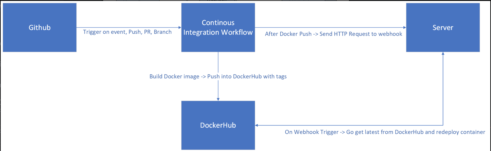

# Project 5: CD
## Project Overview

# Part 1: Semantic Versioning
## How to generate a tag in git / github

## Behavior of github workflow
#### run when a tag is pushed
runs on push to main with a tag like v1.0.0
``` 
on:
  push:
    branches:
      - "main"
    tags:
      - 'v*.*.*'
```

#### use the docker/metadata-action to generate a set of tags from your repository
pushes git tag to docker - if git commit isn't tagged, workflow will push to latest instead
``` 
jobs:
  docker:
  steps:
.............
    name: Docker meta
        id: meta
        uses: docker/metadata-action@v5
        with:
          images: |
            paxson13/rensite
          tags: |
            latest
            type=semver,pattern=v{{major}}
            type=semver,pattern=v{{major}}.{{minor}}
```
`pattern={{major}}` and `pattern=v{{major}}.{{minor}}` copies the git tag into docker

Order of operations with tagging:
1. git add -A
2. git commit -m "message"
3. git tag v*.\*.*
4. git push
5. git push origin --tags: tags the last commit

#### [Rensite Docker Hub repo](https://hub.docker.com/repository/docker/paxson13/rensite/general)

# Part 2: Deployment
#### installing docker
1. `sudo curl -fsSL https://download.docker.com/linux/ubuntu/gpg -o /etc/apt/keyrings/docker.asc`
2. `sudo chmod a+r /etc/apt/keyrings/docker.asc`
3. `echo "deb [arch=$(dpkg --print-architecture) signed-by=/etc/apt/keyrings/docker.asc] https://download.docker.com/linux/ubuntu \ $(. /etc/os-release && echo "$VERSION_CODENAME") stable" |   sudo tee /etc/apt/sources.list.d/docker.list > /dev/null`
4. `sudo apt-get install docker-ce docker-ce-cli containerd.io docker-buildx-plugin docker-compose-plugin`

#### [link to Restart script](./deployment/script.sh)
This script kills the previous container and pulls the most recent image then reruns it. The script should be in home because a different user may not have all of my folders
``` 
#! /bin/bash
docker stop rensite
docker rm rensite
docker pull paxson13/rensite:latest
docker run --name rensite -p 80:80 -d paxson13/rensite
```

#### Setting up webhook 
Webhook is a http server that creates endpoints that can be used to execute commands on the server it's running on. The [hooks.json](deployment/hooks.json) file should be in home because a different user may not have all of my folders.

``` 
[
  {
    "id": "redeploy-webhook",
    "execute-command": "script.sh",
    "command-working-directory": "/home/ubuntu"
  }
]
```

#### Starting webhook
`sudo webhook -hooks hooks.json -verbose`
#### [Webhook Service file ](deployment/webhook.service)
Had to go into `/lib/systemd/system` and modify the `webhook.service` file to follow the path to the script in home/ubuntu, then the file location in `execstart` under `Service`, and then I changed the file description for fun.
Most of the contents of this file were part of the original `webhook.service` file
``` 
[Unit]
Description=web hookin
Documentation=https://github.com/adnanh/webhook/
ConditionPathExists=/home/ubuntu

[Service]
ExecStart=/usr/bin/webhook -nopanic -hooks /home/ubuntu/hooks.json

[Install]
WantedBy=multi-user.target
```

sources: 
[How to create a systemd service in Linux ](https://linuxhandbook.com/create-systemd-services/)
[CI/CD with Webhook](https://hub.analythium.io/docs/shinyproxy-webhook/)

#### Proof that the CICD flow works

# Part 3 - Diagramming

