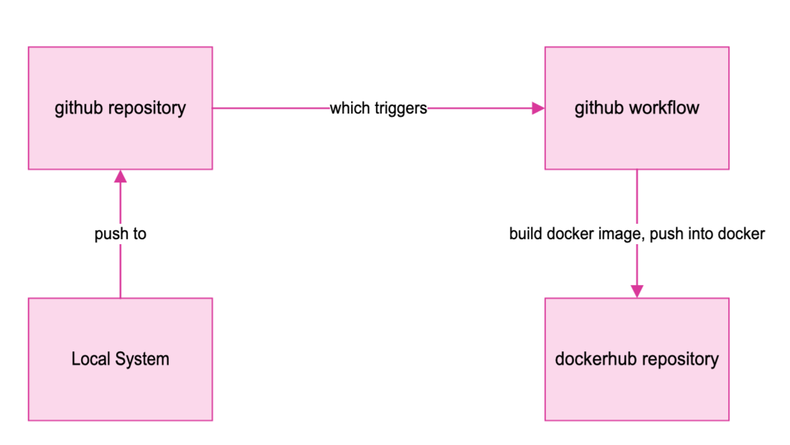
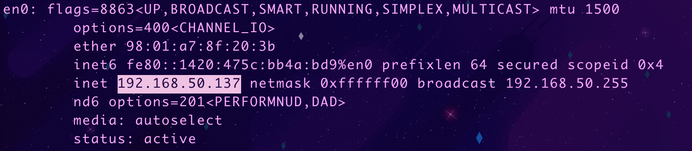

# CI Project Overview
This project covers containerizing a nginx website build using docker.

## CI Flow diagram


## How to install docker
1. On mac: download docker desktop

## How to build image from dockerfile
1. `vim Dockerfile` - this file should be in the directory you are trying to containerize
2. file contents:
```
FROM [source image]
COPY [necessary contents to local directories, like site / config files]
RUN [execute build command]
VOLUME [Create volume mounts - file path]
COPY [necessary files to the image]
EXPOSE [port to bind to] 
```
So [my DockerFile](./website/Dockerfile) for this project ended up looking like this:
``` 
FROM nginx
RUN rm /etc/nginx/nginx.conf /etc/nginx/conf.d/default.conf
VOLUME /usr/share/nginx/html
VOLUME /etc/nginx
COPY ./html /usr/share/nginx/html 
COPY nginx.conf /etc/nginx
EXPOSE 80
```
3. `docker build -t image_name .` to build a container called image_name using the current directory 

## How to run a container
1. `docker pull paxson13/rensite:latest` to pull the latest version of the container
2. `sudo docker run --name [name] -p 80:80 -d paxson13/rensite`

## How to view the project
1. On mac: `ifconfig` then look for en0 inet address:

2. `[your-inet-adress]:80` - entered into a web browser

## Create public repo in DockerHub
1. Go to [hub.docker.com](hub.docker.com) and log in
2. go to "Repositories" along the top bar
2. Select "Create Repository"
3. Choose a meaningful name and select "Create"


# Authentication with dockerhub
Access tokens are recommended for authentication:
1. In dockerhub, go to user account -> security -> new access token
2. Generate key
3. On desired system, run `docker login -u paxson13` and enter the key provided by dockerhub to login

## How to push container image to Dockerhub (without GitHub Actions)
1. Create a new tag with `docker image tag rensite paxson13/rensite:v1.0.0`
2. Push to docker with `docker push paxson13/rensite:v1.0.0`

## [Link to docker repo](https://hub.docker.com/repository/docker/paxson13/rensite/general)

## Configuring GitHub secrets
1. Go to desired GitHub repository home page 
2. Select `settings` on the top bar
3. In settings, look for `security` in the sidebar, then `secrets and variables`, select the drop down, then `actions`
4. i put my secrets in `Repository Secrets`:
   - `DOCKER_USERNAME`
   - `DOCKER_TOKEN`

## [Github workflow](https://docs.docker.com/build/ci/github-actions/)
1. to set up an action, follow the guide linked above  

this changed in project 5, [heres a link](./.github/workflows/ci.yml) to the updated one

#### Workflow breakdown
Each segment of the action is followed by an explanation of what it's doing
```
name: ci
```
`name` is just the name of the action 
```
on:
  push:
    branches:
      - "main"
```
`push`: This action is triggered on a push to main
```
jobs:
  build:
    runs-on: ubuntu-latest
    steps:
      -
        name: Checkout
        uses: actions/checkout@v4
```
`Checkout`: Checks out the repository on the build machine 
```
      -
        name: Login to Docker Hub
        uses: docker/login-action@v3
        with:
          username: ${{ secrets.DOCKERHUB_USERNAME }}
          password: ${{ secrets.DOCKERHUB_TOKEN }}
```
`Login to docker hub`: This job triggers a login to dockerhub using the GitHub secrets
```
      -
        name: Set up Docker Buildx
        uses: docker/setup-buildx-action@v3
```
`Set up Docker Buildx`: Creates a BuildKit builder instance using the Docker Setup Buildx action
```
      -
        name: Build and push
        uses: docker/build-push-action@v5
        with:
          context: . [path]
          file: ./Dockerfile [path to dockerfile]
          push: true
          tags: ${{ secrets.DOCKERHUB_USERNAME }}/[image name]:latest 
```
Builds the container image and pushes it to the Docker Hub repository, using Build and push Docker images
